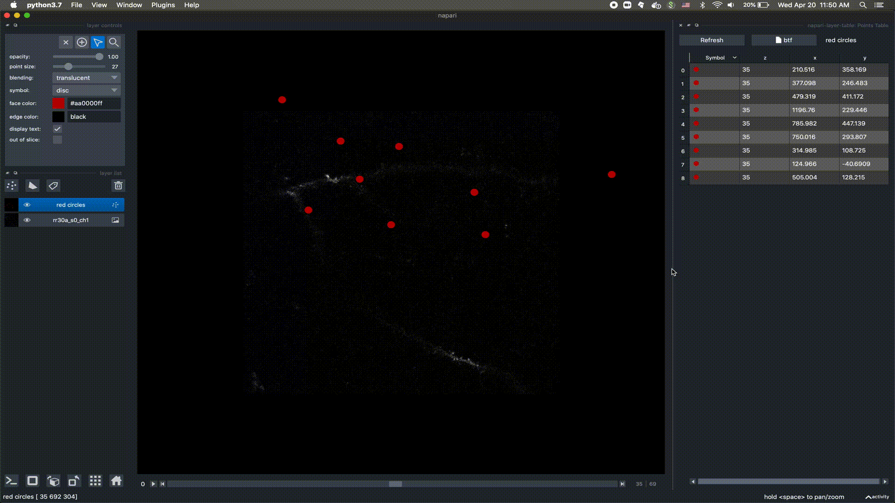

# napari-layer-table

<!--  -->
<!--  -->

A plugin to display a layer as a table.

This will work well with point layers. We are debugging shapes and labeled layers, come back to check on that!

----------------------------------

This [napari] plugin was generated with [Cookiecutter] using [@napari]'s [cookiecutter-napari-plugin] template.

<!--
Don't miss the full getting started guide to set up your new package:
https://github.com/napari/cookiecutter-napari-plugin#getting-started

and review the napari docs for plugin developers:
https://napari.org/plugins/stable/index.html
-->

## Installation

You can install `napari-layer-table` via [pip]:

    pip install napari-layer-table

To install latest development version :

    pip install git+https://github.com/mapmanager/napari-layer-table.git

## Using the Plugin

You can use the napari-layer-table plugin to display points layer as a table.

- Open a napari viewer with a Points layer
- Add the plugin to the napari viewer from Plugins menu -> Add dock widget -> napari-layer-table: Points Table
- The selected layer is displayed in the table.
- The table has columns for:
    - Point symbol with face color
    - Point coordinates (x,y,z)
    - If the layer has properties, they are also shown as columns

## Plugin Features

- Bi-directional selection between layer and table.
- Bi-directional deletion between layer and table.
- Points added to the layer are added to the table.
- Points moved in the layer are updated in the table.
- Multiple points selected in the layer are also selected in the table
- Changes to face color and symbol in the layer are updated in the table.
- Ability to sort individual columns from low to high or high to low
- `Refresh` button to manually refresh the table data
- `btf` button to manually bring the layer whose table data is being shown to front

Right-click for context menu to:

- Toggle table columns on/off.
- Toggle shift+click to add a point to the layer (no need to switch viewer mode)
- Copy table to clipboard

## Contributing

Contributions are very welcome. Tests can be run with [tox], please ensure
the coverage at least stays the same before you submit a pull request.

## License

Distributed under the terms of the [GNU GPL v3.0] license,
"napari-layer-table" is free and open source software

## Issues

If you encounter any problems, please [file an issue] along with a detailed description.

[napari]: https://github.com/napari/napari
[Cookiecutter]: https://github.com/audreyr/cookiecutter
[@napari]: https://github.com/napari
[MIT]: http://opensource.org/licenses/MIT
[BSD-3]: http://opensource.org/licenses/BSD-3-Clause
[GNU GPL v3.0]: http://www.gnu.org/licenses/gpl-3.0.txt
[GNU LGPL v3.0]: http://www.gnu.org/licenses/lgpl-3.0.txt
[Apache Software License 2.0]: http://www.apache.org/licenses/LICENSE-2.0
[Mozilla Public License 2.0]: https://www.mozilla.org/media/MPL/2.0/index.txt
[cookiecutter-napari-plugin]: https://github.com/napari/cookiecutter-napari-plugin

[file an issue]: https://github.com/mapmanager/napari-layer-table/issues

[napari]: https://github.com/napari/napari
[tox]: https://tox.readthedocs.io/en/latest/
[pip]: https://pypi.org/project/pip/
[PyPI]: https://pypi.org/
