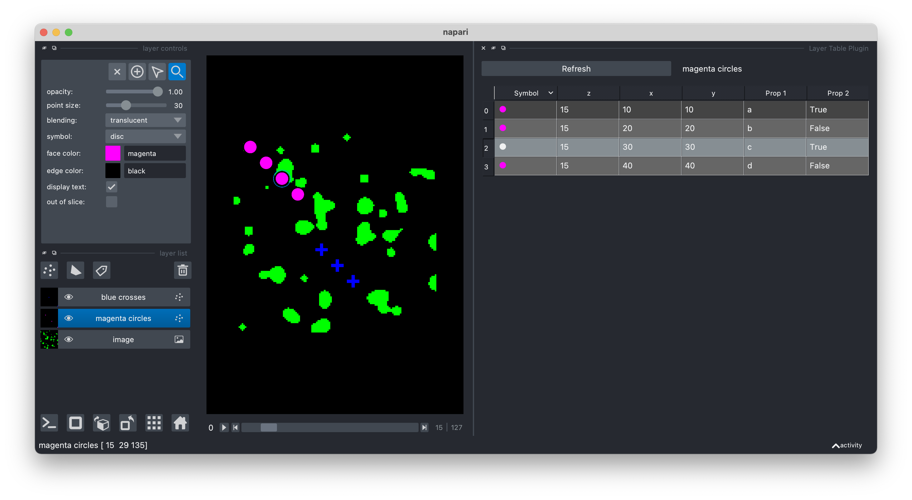

# Welcome to napari-layer-table

A Napari plugin to display a layer as a table. We currently handle point, shape, and labeled layers.

## Interface overview

 - The selected layer is displayed in the table.
 - The table has columns for:

     - Point symbol with face color
	 - Point coordinates (x,y,z)
	 - If the layer has properties, these are also columns

 - Bi-directional selection between layer and table.
 - Bi-directional delete between layer and table.
 - Points added to the layer are added to the table.
 - Points moved in the layer are updated in the table.
 - Changes to face color and symbol in the layer are updated in the table.

 Right-click for context menu to:

 - Toggle table columns on/off.
 - Toggle shift+click to add a point to the layer (no need to switch viewer mode)
 - Copy table to clipboard

## How to use

 - Select a points layer in the napari viewer and run the plugin

## Include in your own code

It is easy to include the napari-layer-table plugin in your own custom code. See [Scripting](scripting) for more information.

## Future directions

We are working to extend the plugin to display a table for other Napari layer types including: Labels, Shapes, Tracks, and Vectors.