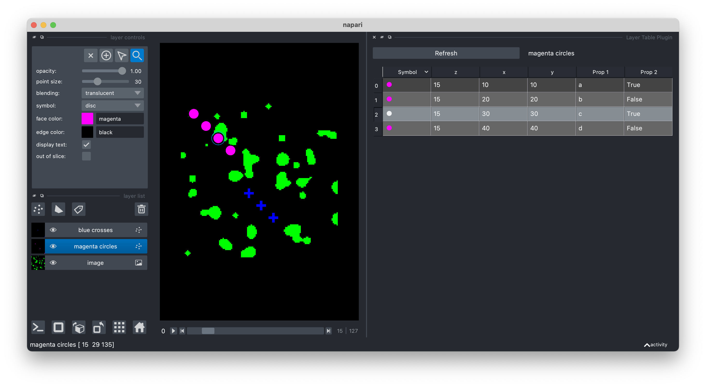

## How to script

It is easy to use the napari-layer-table from your own code.

TODO: How do we link to the examples/ folder in the repo?

See example scripts in [examples/](../../examples)



```
# create viewer

# create layer

# run the plugin

# connect to plugin signal/slot
```
